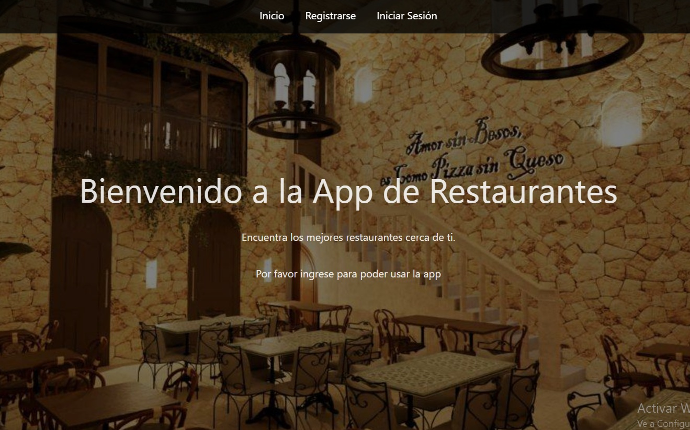
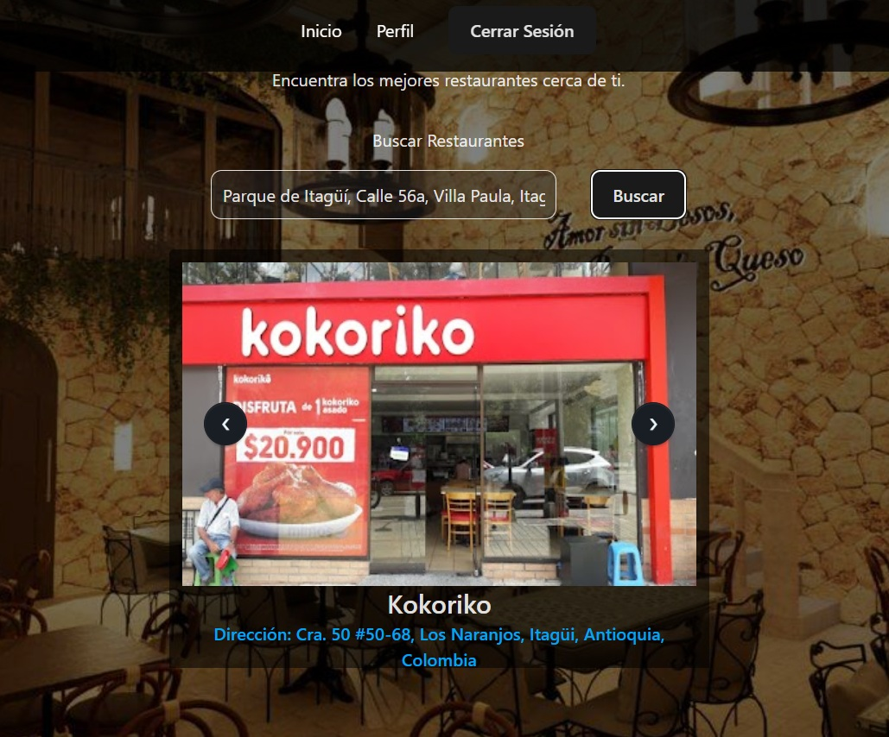

# 🍔 App de Restaurantes

¡Bienvenido a la App de Restaurantes! Esta aplicación permite a los usuarios buscar restaurantes cercanos, registrarse, iniciar sesión y ver su historial de búsquedas.

## 📝 Descripción

Esta es una aplicación web desarrollada con **React usando Vite** en el front-end y **Node.js usando Express** en el back-end. Los usuarios pueden:

- Registrarse e iniciar sesión.
- Buscar restaurantes cercanos utilizando su ubicación.
- Ver un historial de sus búsquedas anteriores.

## 🖼️ Capturas de Pantalla

### Página de Inicio


### Resultados de Búsqueda


## 🛠️ Instalación

Sigue estos pasos para instalar y ejecutar el proyecto en tu máquina local:

1. **Clona el repositorio**:
   ```bash
   git clone https://github.com/tu-usuario/Proyecto-Restaurant.git
   cd Proyecto-Restaurant
2. **Instala las dependencias del back-end:**
    ```bash
    cd backend
    npm install
3. **Instala las dependencias del front-end:**
    ```bash Copy
    cd ../frontend
    npm install
4. **Configura las variables de entorno:**
    ```bash Copy
    Crea un archivo .env en la carpeta backend y agrega las siguientes variables:
    PORT=5000
    MONGODB_URI=tu-mongodb-uri-generada-en-mongodb
    JWT_SECRET=tu-clave-secreta
    GOOGLE_API_KEY=tu-api-key-genrada-en-google-cloude
5. **Inicia el servidor back-end:**
    ```bash
    Copy
    cd ../backend
    npm run start
6. **Inicia el servidor front-end:**
   ```bash
    Copy
    cd ../frontend
    npm run dev
7. **Abre tu navegador y visita:**
    ```bash
    Copy
    http://localhost:5173

## ⚙️ Configuración

Variables de Entorno
Asegúrate de configurar las siguientes variables de entorno en el archivo .env del back-end:

- PORT: Puerto en el que se ejecutará el servidor.

- MONGODB_URI: URL de conexión a la base de datos MongoDB.

- JWT_SECRET: Clave secreta para firmar los tokens JWT.

- VITE_APP_API_URL: URL base de la API (usada en el front-end).

Base de Datos:

La aplicación utiliza MongoDB como base de datos. Asegúrate de tener MongoDB instalado y en ejecución.

## 🚀 Uso

1. Registro: Ve a /signup para crear una nueva cuenta.

2. Inicio de Sesión: Ve a /signin para iniciar sesión.

3. Búsqueda de Restaurantes: Una vez autenticado, puedes buscar restaurantes cercanos en un área de 1500 metros a la redonda de la dirección que proporciones en la página de inicio.

4. Historial: Ve a /profile para ver tu historial de búsquedas.

## 🛠️ Tecnologías Utilizadas
Front-End:

- React

- Tailwind CSS (o el framework CSS que uses)

- React Router

Back-End:

- Node.js

- Express.js

- MongoDB

Autenticación:

- JWT (JSON Web Tokens)

## 📂 Estructura del Proyecto
    /proyecto
    ├── backend
    │   ├── controllers
    │   ├── models
    │   ├── routes
    │   ├── middlewares
    │   ├── config
    │   ├── utils
    │   ├── server.js
    │   └── package.json
    ├── frontend
    │   ├── public
    │   ├── src
    │   │   ├── components
    │   │   ├── context
    │   │   ├── pages
    │   │   ├── services
    │   │   ├── App.js
    │   │   └── index.js
    │   ├── package.json
    │   └── README.md
    └── README.md

## 🤝 Contribución
Si deseas contribuir a este proyecto, sigue estos pasos:

Haz un fork del repositorio.

    Crea una rama con tu nueva funcionalidad:
    git checkout -b nombre-de-tu-rama

    Realiza tus cambios y haz commit:
    git commit -m "Descripción de tus cambios"

    Sube tus cambios:
    git push origin nombre-de-tu-rama

Abre un Pull Request en GitHub.

## 📄 Solución Implementada y Decisiones Técnicas

### **Solución Implementada**
La aplicación está diseñada para permitir a los usuarios buscar restaurantes cercanos a una dirección ingresada, registrarse, iniciar sesión y ver su historial de búsquedas. Se implementaron las siguientes funcionalidades principales:

1. **Autenticación de Usuarios**:
   - Los usuarios pueden registrarse e iniciar sesión utilizando un correo electrónico y contraseña.
   - Se utiliza **JWT (JSON Web Tokens)** para manejar la autenticación y mantener la sesión del usuario.

2. **Búsqueda de Restaurantes**:
   - Los usuarios pueden buscar restaurantes cercanos utilizando su ubicación.
   - Se integra una API externa **Google Places** para obtener los datos de los restaurantes.

3. **Historial de Búsquedas**:
   - Las búsquedas realizadas por los usuarios se guardan en una base de datos MongoDB.
   - Los usuarios pueden ver su historial de búsquedas en su perfil.

### **Decisiones Técnicas**
1. **Front-End**:
   - Se utilizó **React** para construir una interfaz de usuario dinámica y reactiva.
   - Se implementó **React Router** para manejar la navegación entre páginas.
   - Se usó **Tailwind CSS** para estilizar la aplicación de manera eficiente.

2. **Back-End**:
   - Se utilizó **Node.js** con **Express.js** para construir el servidor.
   - Se implementó **MongoDB** como base de datos para almacenar usuarios y búsquedas.
   - Se usó **JWT** para manejar la autenticación de usuarios de manera segura.

3. **Arquitectura**:
   - Se siguió una arquitectura modular, separando el código en carpetas como `controllers`, `models`, `routes`, y `middlewares`.
   - Se implementaron principios **SOLID** para mantener un código limpio y escalable.

4. **Despliegue**:
   - El front-end se ejecuta en un servidor de desarrollo (Vite) en `http://localhost:5173`.
   - El back-end se ejecuta en `http://localhost:5000` y se comunica con el front-end a través de una API REST.

5. **Optimización**:
   - Se utilizó **lazy loading** para cargar componentes de React solo cuando son necesarios.
   - Se implementó un sistema de caché para almacenar búsquedas recientes y mejorar el rendimiento.

## 📄 Licencia
Este proyecto está bajo la licencia MIT. Consulta el archivo LICENSE para más detalles.